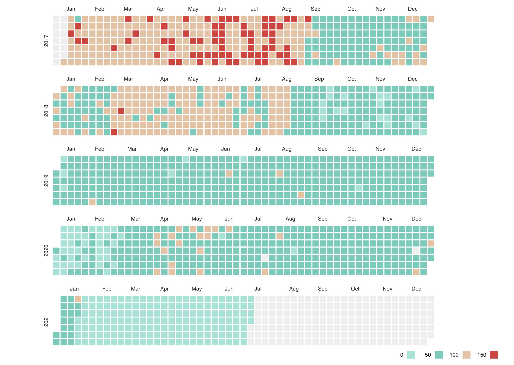

## Sajten

Jag har tidigare [skrivit lite](/blogg/att-vacka-liv-i-ett-3-ar-gammalt-projekt) om en sajt/scraper jag byggt - som via en api-endpoint parsa startsidan på Aftonbladet och sparar ned viss data om Aftonbladets startsida i Google Firebase.

Endpointen anropas dagligen klockan 12 och har nu fungerat felfritt i ett antal år, fram till i år.

## Aftonbladet förstör för scrapern

Bilden ovan illustrerar data för varje dag som scrapern har skannat av Aftonbladets startsida från första dagen till skrivande stund (juli 2021).

> Något som är helt orelaterat men ändå intressant är om man tittar från 2017-2019. Aftonbladet drog ned användandet av ✔ i sina artikelpuffar rätt så mycket under den här perioden. Sedan pandemin drog igång 2020 så gick användandet upp igen däremot. Men nu var det inte det vi skulle fokusera på.

I början på 2021 så ser man något avvikande. Helt plötsligt fångar scrapern inte alls lika mycket data. Beror det på att användandet av ✔ har minskat?

När jag upptäckte det här (lite i efterhand) så besökte jag Aftonbladet för att se vad som kan ha hänt. Har dom ändrat HTML-strukturen för att fånga alla ✔?

Jag skrollade runt på sajten och upptäckte att Aftonbladet laddar inte in hela startsidan på en gång längre utan dom har implementerat **Infinite scroll** - innehåll laddar allt eftersom man skrollar.

Inte så konstigt att min scraper misslyckas med att samla in alla data korrekt alltså.

Kikar man på den här bilden så verkar det dessutom som att Aftonbladet lanserade denna feature 20/01/2021:

Den dagen fångades bara 12 stycken checkar och sedan dess har mycket färre checkar sparats ned i Google Firebase.

## Ännu färre datapunkter efter ett tag

Jaha. Min scraper fångar inte längre alla checkar som används på startsidan. När jag upptäckte det här problemet gjorde jag dock inget åt det på en gång.

Jag höll däremot lite koll under 2021 och kunde efter ett tag se det här fenomenet:

Helt plötsligt fångades **ingen data** alls. Vad har Aftonbladet nu hittat på? När jag upptäckte detta gick jag till deras startsida och kunde se att checkar ritades ju faktiskt ut.

Jag inspekterade HTML-koden och kunde se att checkarna däremot ritades ut på ett nytt sätt. Min scraper kunde inte urskilja dem då scrapern letade efter en css-klass som inte längre användes för att rita ut checkarna.

## Att fixa eller inte fixa

Nu var alltså min scraper helt trasig egentligen och skulle behöva uppdateras:

- Se till att hela startsidan läses in i scrapern för att fånga alla checkar.
- Uppdatera scrapern för att identifiera checkarna på nytt.
- _(Nice to have) någon slags monitorering för att snabbare fånga om scrapern fångar ett avvikande antal datapunkter._

Är det här något jag har fixat? Nope… Det här är ju bara ett litet sidoprojekt, som dessutom inte kostar mig något i drift eller så. Det känns inte heller värt att släcka ned sajten då den ändå har historisk data från 2017 som ändå är lite intressant.

> Lusten att pyssla med såna här programmeringsprojekt vid sidan av jobbet kommer och går i perioder.

De här problemen har uppstått under en period då lusten för hobbyprogrammering är relativt låg. Då tycker jag ändå det är viktigt att inte tvinga sig själv att fortsätta sitta framför datorn och knacka kod när arbetsdagen är slut. Då är det bättre att göra något annat, så kanske suget är tillbaka efter ett tag.
